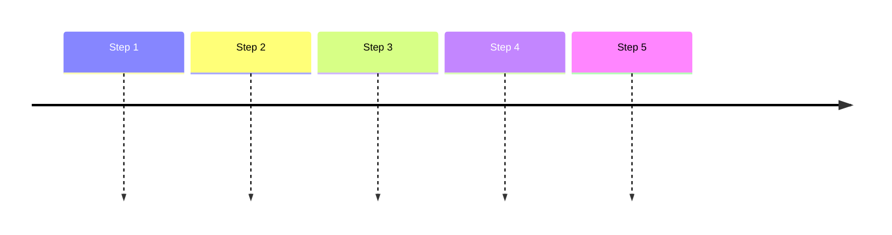
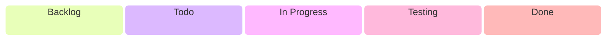

<h1 align="center"> 🎴 nodeck 🎴 </h1>

<p align="center">
  
  
  
</p>
<p align="center">
  
  
  
  
  
  
  
  
</p>

Nodeck is a card-centered gallery for organizing visual objects, tags, and collections. Objects and tags are displayed as standalone cards, while collections behave like decks that group related cards into a focused browsing experience.

## Overview

The project is built around the idea that a gallery can feel like a deck system: every object is a card, every tag is a card, and every collection is a deck. The backend exposes a small ASP.NET Core Minimal API powered by .NET 9 and MySQL, while the frontend uses React 18, Vite, Tailwind CSS, and shadcn/ui for a fast, clean, card-based interface.

## Features

- Card gallery for browsing saved objects.
- Tag cards for visual grouping, filtering, and quick discovery.
- Collection decks that combine related objects and tags.
- MySQL-backed storage for cards, tags, decks, and related gallery data.
- Minimal API backend with a compact, predictable HTTP surface.
- Docker Compose setup with the backend and database running in separate containers.
- React 18 frontend optimized for fast gallery navigation.
- shadcn/ui component setup for simple, consistent interface building.
- Tailwind CSS 4 styling pipeline integrated through Vite.
- Vite development workflow with quick reloads.

## Screenshots

<table>
  <tr>
    <td></td>
    <td></td>
  </tr>
</table>

## Installation

1. Install the required SDKs and tooling:
   - .NET 9 SDK;
   - Node.js with npm;
   - Docker and Docker Compose.

2. Clone the repository:

```bash
git clone https://github.com/TimCixo/nodeck.git
cd nodeck
```

3. Restore backend and frontend dependencies from their project directories when developing outside containers.

```bash
dotnet restore
npm install
```

4. Create a `.env` file for Docker Compose and MySQL settings.

```bash
cp .env.example .env
```

## Usage

<p align="center">
  
</p>

Run the composed project so the backend API starts in one container and MySQL starts in another. The frontend can be served separately by Vite during development or added to the compose file as the project grows.

Typical container workflow:

```bash
docker compose up --build
```

Typical frontend workflow:

```bash
npm run dev
```

Open the Vite URL in a browser. Use the gallery to create or browse object cards, assign tag cards, and organize related cards into collection decks.

## Project Structure

```text
nodeck/
├── docker-compose.yml
├── .env
│
├── backend/
│   ├── Dockerfile
│   ├── MyApp.Api.csproj
│   ├── Program.cs
│   ├── appsettings.json
│   └── src/
│
├── frontend/
│   ├── components.json
│   ├── package.json
│   ├── vite.config.ts
│   ├── index.html
│   └── src/
│       ├── components/
│       │   └── ui/
│       ├── lib/
│       └── index.css
│
└── volumes/
    ├── app_data/
    │   ├── config/
    │   ├── uploads/
    │   ├── cache/
    │   ├── cards/
    │   └── user-data/
    │
    └── mysql_data/
        └── /var/lib/mysql
```

## Configuration

The backend should keep application settings in the standard ASP.NET Core configuration files and environment variables. MySQL connection settings should be provided through `.env` and passed into the backend container by Docker Compose.

The MySQL container should store database files in `volumes/mysql_data`, while application files such as uploads, cache, generated card assets, and user data should live under `volumes/app_data`.

The frontend should keep Vite configuration in the frontend project and use an environment variable for the API base URL when the backend address differs from the default development setup.

shadcn/ui is configured through `frontend/components.json`. Shared UI primitives live in `frontend/src/components/ui`, shared helpers live in `frontend/src/lib`, and the `@` import alias points to `frontend/src`.

## Development

- Backend: ASP.NET Core Minimal API on .NET 9.
- Database: MySQL in a dedicated Docker container.
- Runtime: backend container composed together with the MySQL container.
- Frontend: React 18 with Vite.
- UI: shadcn/ui components on top of Tailwind CSS 4.
- UI model: objects and tags are cards; collections are decks.

Recommended development flow:

1. Start the composed backend and MySQL services.
2. Start the Vite dev server.
3. Build interface pieces from shadcn/ui primitives in `frontend/src/components/ui`.
4. Update card, tag, or deck behavior in small increments.
5. Keep API contracts and UI state aligned when changing gallery data models.

## Roadmap



## Development Board



## Contributing

Contributions are welcome.

You can help by:
- reporting bugs;
- suggesting new features;
- improving documentation;
- testing the gallery with different card, tag, and deck structures;
- submitting pull requests.

Before making large changes, please open an issue first to discuss the idea.

## License

This project is licensed under the terms of the license included in the repository.

See the LICENSE file for details.

## Credits

Created by [TimCixo](https://github.com/TimCixo).

Built as a card-first gallery for collecting, tagging, and arranging visual objects into decks.
